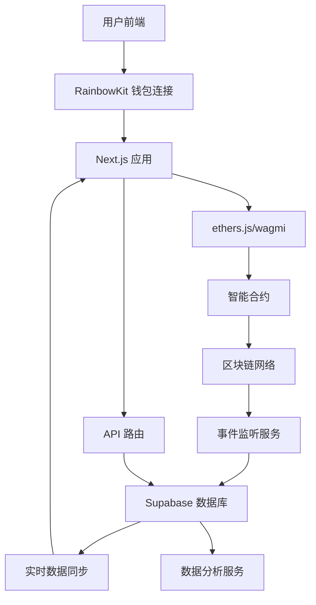

# 🔄 前后端联动架构

## 概述

本文档详细描述了质押系统的前后端联动架构，包括数据流向、API设计、错误处理、性能优化等关键技术实现。

## 系统交互流程



## 1. 前端到合约的数据流

### 用户操作流程
```typescript
// 1. 用户连接钱包 (前端)
const { connect } = useConnect();
await connect({ connector: metaMaskConnector });

// 2. 获取合约实例 (前端)
const contract = useContract({
  address: STAKE_CONTRACT_ADDRESS,
  abi: StakeContractABI,
  signerOrProvider: signer
});

// 3. 执行质押操作 (前端 → 合约)
const { write: stake } = useContractWrite({
  address: STAKE_CONTRACT_ADDRESS,
  abi: StakeContractABI,
  functionName: 'stake',
  args: [poolId, amount],
  onSuccess: (data) => {
    // 4. 交易成功后更新本地状态
    updateUserBalance();
    // 5. 记录交易到数据库
    recordTransaction(data.hash);
  }
});
```

## 2. 合约到数据库的数据流

### 事件监听和数据同步
```javascript
// services/event-listener.js
class EventListener {
  constructor() {
    this.contract = new ethers.Contract(
      STAKE_CONTRACT_ADDRESS,
      StakeContractABI,
      provider
    );
  }

  async startListening() {
    // 监听质押事件
    this.contract.on('Staked', async (user, poolId, amount, event) => {
      await this.syncStakeEvent({
        user,
        poolId: poolId.toNumber(),
        amount: ethers.utils.formatEther(amount),
        txHash: event.transactionHash,
        blockNumber: event.blockNumber
      });
    });

    // 监听解质押事件
    this.contract.on('Unstaked', async (user, poolId, amount, event) => {
      await this.syncUnstakeEvent({
        user,
        poolId: poolId.toNumber(),
        amount: ethers.utils.formatEther(amount),
        txHash: event.transactionHash,
        blockNumber: event.blockNumber
      });
    });
  }

  async syncStakeEvent(eventData) {
    // 1. 更新交易记录
    await supabase.from('stake_transactions').insert({
      wallet_address: eventData.user,
      pool_id: eventData.poolId,
      transaction_type: 'stake',
      amount: eventData.amount,
      tx_hash: eventData.txHash,
      block_number: eventData.blockNumber,
      status: 'confirmed'
    });

    // 2. 更新用户持仓
    await this.updateUserPosition(eventData.user, eventData.poolId);

    // 3. 更新池子统计
    await this.updatePoolStats(eventData.poolId);
  }
}
```

## 3. 数据库到前端的数据流

### 实时数据获取
```typescript
// hooks/useStakeData.ts
export const useStakeData = (walletAddress: string) => {
  const [userData, setUserData] = useState(null);
  const [poolStats, setPoolStats] = useState([]);

  // 1. 获取用户持仓数据
  const fetchUserData = async () => {
    const { data } = await supabase
      .from('user_pool_positions')
      .select('*')
      .eq('wallet_address', walletAddress);
    
    setUserData(data);
  };

  // 2. 获取池子统计数据
  const fetchPoolStats = async () => {
    const { data } = await supabase
      .from('pool_stats')
      .select('*')
      .order('recorded_at', { ascending: false })
      .limit(1);
    
    setPoolStats(data);
  };

  // 3. 实时订阅数据变化
  useEffect(() => {
    const subscription = supabase
      .channel('stake_data')
      .on('postgres_changes', {
        event: '*',
        schema: 'public',
        table: 'user_pool_positions',
        filter: `wallet_address=eq.${walletAddress}`
      }, (payload) => {
        // 实时更新用户数据
        fetchUserData();
      })
      .subscribe();

    return () => subscription.unsubscribe();
  }, [walletAddress]);

  return { userData, poolStats, fetchUserData, fetchPoolStats };
};
```

## 4. API 路由设计

### Next.js API 路由
```typescript
// pages/api/user/[address].ts
export default async function handler(req: NextApiRequest, res: NextApiResponse) {
  const { address } = req.query;

  try {
    // 1. 获取链上数据
    const contract = new ethers.Contract(STAKE_CONTRACT_ADDRESS, ABI, provider);
    const onChainData = await contract.getUserInfo(0, address);

    // 2. 获取链下数据
    const { data: offChainData } = await supabase
      .from('user_pool_positions')
      .select('*')
      .eq('wallet_address', address);

    // 3. 合并数据
    const combinedData = {
      onChain: {
        stakedAmount: ethers.utils.formatEther(onChainData.stAmount),
        pendingRewards: ethers.utils.formatEther(onChainData.pendingMetaNode)
      },
      offChain: offChainData,
      lastUpdated: new Date().toISOString()
    };

    res.status(200).json(combinedData);
  } catch (error) {
    res.status(500).json({ error: 'Failed to fetch user data' });
  }
}

// pages/api/pools/stats.ts
export default async function handler(req: NextApiRequest, res: NextApiResponse) {
  try {
    // 1. 获取所有池子的链上数据
    const poolsData = await Promise.all(
      Array.from({ length: POOL_COUNT }, async (_, i) => {
        const poolInfo = await contract.getPoolInfo(i);
        return {
          poolId: i,
          totalStaked: ethers.utils.formatEther(poolInfo.stTokenAmount),
          poolWeight: poolInfo.poolWeight.toNumber(),
          lastRewardBlock: poolInfo.lastRewardBlock.toNumber()
        };
      })
    );

    // 2. 获取历史统计数据
    const { data: historicalData } = await supabase
      .from('pool_stats')
      .select('*')
      .order('recorded_at', { ascending: false })
      .limit(100);

    res.status(200).json({
      current: poolsData,
      historical: historicalData
    });
  } catch (error) {
    res.status(500).json({ error: 'Failed to fetch pool stats' });
  }
}
```

## 5. 数据一致性保证

### 双向验证机制
```typescript
// services/data-consistency.ts
class DataConsistencyService {
  // 定期验证链上链下数据一致性
  async validateDataConsistency() {
    const users = await this.getAllActiveUsers();
    
    for (const user of users) {
      // 1. 获取链上数据
      const onChainData = await contract.getUserInfo(0, user.wallet_address);
      
      // 2. 获取链下数据
      const { data: offChainData } = await supabase
        .from('user_pool_positions')
        .select('*')
        .eq('wallet_address', user.wallet_address);

      // 3. 比较数据
      const isConsistent = this.compareData(onChainData, offChainData[0]);
      
      if (!isConsistent) {
        // 4. 数据不一致时的处理
        await this.handleInconsistency(user.wallet_address, onChainData, offChainData[0]);
      }
    }
  }

  async handleInconsistency(address: string, onChain: any, offChain: any) {
    // 记录不一致日志
    console.error(`Data inconsistency detected for ${address}`);
    
    // 以链上数据为准，更新链下数据
    await supabase
      .from('user_pool_positions')
      .update({
        staked_amount: ethers.utils.formatEther(onChain.stAmount),
        pending_rewards: ethers.utils.formatEther(onChain.pendingMetaNode),
        last_action_at: new Date().toISOString()
      })
      .eq('wallet_address', address);
  }
}
```

## 6. 错误处理和重试机制

### 前端错误处理
```typescript
// hooks/useTransactionHandler.ts
export const useTransactionHandler = () => {
  const [isLoading, setIsLoading] = useState(false);
  const [error, setError] = useState<string | null>(null);

  const handleTransaction = async (txFunction: () => Promise<any>) => {
    setIsLoading(true);
    setError(null);

    try {
      // 1. 执行交易
      const tx = await txFunction();
      
      // 2. 等待确认
      const receipt = await tx.wait();
      
      // 3. 更新本地状态
      await updateLocalState(receipt);
      
      // 4. 验证数据同步
      await verifyDataSync(receipt.transactionHash);
      
      return receipt;
    } catch (err: any) {
      // 5. 错误处理
      setError(err.message);
      throw err;
    } finally {
      setIsLoading(false);
    }
  };

  return { handleTransaction, isLoading, error };
};
```

## 7. 实际应用场景

### 场景1：用户质押流程
```typescript
// 完整的质押流程示例
const StakeFlow = () => {
  const { address } = useAccount();
  const { handleTransaction } = useTransactionHandler();
  const { userData, fetchUserData } = useStakeData(address);

  const handleStake = async (poolId: number, amount: string) => {
    try {
      // 1. 前端验证
      if (!address) throw new Error('请先连接钱包');
      if (parseFloat(amount) <= 0) throw new Error('质押金额必须大于0');

      // 2. 检查余额
      const balance = await getTokenBalance(address);
      if (balance < parseFloat(amount)) throw new Error('余额不足');

      // 3. 执行质押交易
      await handleTransaction(async () => {
        return await stake({ args: [poolId, parseEther(amount)] });
      });

      // 4. 等待数据同步
      setTimeout(() => {
        fetchUserData();
      }, 3000);

      // 5. 显示成功消息
      toast.success('质押成功！');
    } catch (error) {
      toast.error(error.message);
    }
  };

  return (
    <StakeForm onSubmit={handleStake} userData={userData} />
  );
};
```

### 场景2：实时收益计算
```typescript
// 实时收益计算和显示
const RewardsCalculator = () => {
  const { address } = useAccount();
  const [realTimeRewards, setRealTimeRewards] = useState('0');

  useEffect(() => {
    if (!address) return;

    // 每10秒更新一次收益
    const interval = setInterval(async () => {
      try {
        // 1. 获取链上实时收益
        const pendingRewards = await contract.pendingMetaNode(0, address);
        
        // 2. 获取历史收益数据
        const { data: historicalRewards } = await supabase
          .from('reward_history')
          .select('*')
          .eq('wallet_address', address)
          .order('created_at', { ascending: false })
          .limit(1);

        // 3. 计算总收益
        const totalRewards = ethers.utils.formatEther(pendingRewards);
        setRealTimeRewards(totalRewards);

        // 4. 更新数据库中的实时收益
        await supabase
          .from('user_pool_positions')
          .update({ 
            pending_rewards: totalRewards,
            last_updated: new Date().toISOString()
          })
          .eq('wallet_address', address);

      } catch (error) {
        console.error('Failed to update rewards:', error);
      }
    }, 10000);

    return () => clearInterval(interval);
  }, [address]);

  return (
    <div className="rewards-display">
      <h3>实时收益</h3>
      <p>{realTimeRewards} META</p>
    </div>
  );
};
```

### 场景3：数据分析仪表板
```typescript
// 管理员数据分析仪表板
const AdminDashboard = () => {
  const [analytics, setAnalytics] = useState(null);

  useEffect(() => {
    const fetchAnalytics = async () => {
      // 1. 获取池子统计
      const poolStats = await fetch('/api/pools/stats').then(r => r.json());
      
      // 2. 获取用户统计
      const userStats = await supabase
        .from('users')
        .select('count(*)')
        .single();

      // 3. 获取交易统计
      const txStats = await supabase
        .from('stake_transactions')
        .select('transaction_type, amount')
        .gte('created_at', new Date(Date.now() - 24 * 60 * 60 * 1000).toISOString());

      // 4. 计算关键指标
      const totalStaked = poolStats.current.reduce((sum, pool) => 
        sum + parseFloat(pool.totalStaked), 0);
      
      const dailyVolume = txStats.reduce((sum, tx) => 
        sum + parseFloat(tx.amount), 0);

      setAnalytics({
        totalStaked,
        dailyVolume,
        activeUsers: userStats.count,
        poolStats: poolStats.current
      });
    };

    fetchAnalytics();
    
    // 每分钟更新一次
    const interval = setInterval(fetchAnalytics, 60000);
    return () => clearInterval(interval);
  }, []);

  return (
    <div className="admin-dashboard">
      <div className="metrics-grid">
        <MetricCard title="总质押量" value={analytics?.totalStaked} />
        <MetricCard title="24h交易量" value={analytics?.dailyVolume} />
        <MetricCard title="活跃用户" value={analytics?.activeUsers} />
      </div>
      <PoolStatsChart data={analytics?.poolStats} />
    </div>
  );
};
```

## 8. 性能优化策略

### 数据缓存策略
```typescript
// 多层缓存策略
class CacheManager {
  private memoryCache = new Map();
  private readonly CACHE_TTL = 30000; // 30秒

  async getCachedData(key: string, fetcher: () => Promise<any>) {
    // 1. 检查内存缓存
    const cached = this.memoryCache.get(key);
    if (cached && Date.now() - cached.timestamp < this.CACHE_TTL) {
      return cached.data;
    }

    // 2. 检查 localStorage 缓存
    const localCached = localStorage.getItem(key);
    if (localCached) {
      const parsed = JSON.parse(localCached);
      if (Date.now() - parsed.timestamp < this.CACHE_TTL * 2) {
        this.memoryCache.set(key, parsed);
        return parsed.data;
      }
    }

    // 3. 获取新数据
    const freshData = await fetcher();
    const cacheEntry = {
      data: freshData,
      timestamp: Date.now()
    };

    // 4. 更新缓存
    this.memoryCache.set(key, cacheEntry);
    localStorage.setItem(key, JSON.stringify(cacheEntry));

    return freshData;
  }
}

// 使用缓存的数据获取
const useOptimizedStakeData = (address: string) => {
  const cacheManager = new CacheManager();
  
  const fetchUserData = useCallback(async () => {
    return await cacheManager.getCachedData(
      `user_data_${address}`,
      async () => {
        const { data } = await supabase
          .from('user_pool_positions')
          .select('*')
          .eq('wallet_address', address);
        return data;
      }
    );
  }, [address]);

  return { fetchUserData };
};
```

### 批量操作优化
```typescript
// 批量数据更新
class BatchProcessor {
  private updateQueue: any[] = [];
  private readonly BATCH_SIZE = 10;
  private readonly BATCH_DELAY = 1000;

  constructor() {
    // 定期处理批量更新
    setInterval(() => {
      this.processBatch();
    }, this.BATCH_DELAY);
  }

  addUpdate(update: any) {
    this.updateQueue.push(update);
    
    // 如果队列满了，立即处理
    if (this.updateQueue.length >= this.BATCH_SIZE) {
      this.processBatch();
    }
  }

  private async processBatch() {
    if (this.updateQueue.length === 0) return;

    const batch = this.updateQueue.splice(0, this.BATCH_SIZE);
    
    try {
      // 批量更新数据库
      await supabase
        .from('user_pool_positions')
        .upsert(batch);
      
      console.log(`Processed batch of ${batch.length} updates`);
    } catch (error) {
      console.error('Batch processing failed:', error);
      // 重新加入队列重试
      this.updateQueue.unshift(...batch);
    }
  }
}
```

## 9. 监控和日志

### 系统监控
```typescript
// 系统健康监控
class SystemMonitor {
  private metrics = {
    apiCalls: 0,
    errors: 0,
    responseTime: [],
    lastHealthCheck: Date.now()
  };

  async healthCheck() {
    try {
      // 1. 检查数据库连接
      const { error: dbError } = await supabase
        .from('users')
        .select('count(*)')
        .limit(1);

      if (dbError) throw new Error('Database connection failed');

      // 2. 检查合约连接
      const blockNumber = await provider.getBlockNumber();
      if (!blockNumber) throw new Error('Blockchain connection failed');

      // 3. 检查数据同步状态
      const lastSync = await this.getLastSyncTime();
      const syncDelay = Date.now() - lastSync;
      
      if (syncDelay > 300000) { // 5分钟
        throw new Error('Data sync is delayed');
      }

      this.metrics.lastHealthCheck = Date.now();
      return { status: 'healthy', metrics: this.metrics };
    } catch (error) {
      this.metrics.errors++;
      return { status: 'unhealthy', error: error.message };
    }
  }

  logApiCall(endpoint: string, duration: number) {
    this.metrics.apiCalls++;
    this.metrics.responseTime.push(duration);
    
    // 保持最近100次调用的记录
    if (this.metrics.responseTime.length > 100) {
      this.metrics.responseTime.shift();
    }
  }
}
```

## 10. 最佳实践总结

### 开发建议

#### 1. 数据流设计
- **单向数据流**：前端 → 合约 → 事件 → 数据库 → 前端
- **避免循环依赖**：确保数据流向清晰，避免数据竞争
- **事件驱动架构**：使用区块链事件作为数据同步的触发器

#### 2. 错误处理
- **分层错误处理**：网络层、业务层、UI层分别处理对应错误
- **优雅降级**：链上数据不可用时使用缓存数据
- **用户友好提示**：将技术错误转换为用户可理解的提示

#### 3. 性能优化
- **合理缓存策略**：多层缓存，避免重复请求
- **批量处理**：合并多个数据更新操作
- **懒加载**：按需加载数据和组件

#### 4. 安全考虑
- **双重验证**：前端验证 + 合约验证
- **用户确认**：敏感操作需要用户明确确认
- **数据一致性**：定期检查链上链下数据一致性

#### 5. 用户体验
- **实时反馈**：及时显示操作状态和结果
- **加载指示**：长时间操作显示进度
- **离线处理**：网络异常时的优雅处理

## 技术栈总结

### 前端技术栈
- **框架**：Next.js 13+ (App Router)
- **状态管理**：Zustand / Redux Toolkit
- **Web3集成**：wagmi + RainbowKit
- **UI组件**：Tailwind CSS + Headless UI
- **图表库**：Chart.js / Recharts

### 后端技术栈
- **数据库**：Supabase (PostgreSQL)
- **API**：Next.js API Routes
- **事件监听**：ethers.js Event Listeners
- **缓存**：Redis (可选)
- **监控**：自定义监控系统

### 区块链技术栈
- **智能合约**：Solidity
- **开发框架**：Hardhat
- **测试框架**：Hardhat + Chai
- **网络**：Ethereum / Polygon / BSC

这个架构设计确保了系统的可扩展性、可维护性和用户体验，为质押系统提供了完整的技术解决方案。